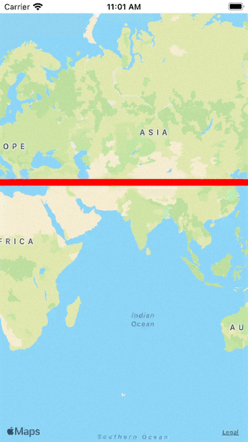

# swiftui-mapkit-overlay-tap-sample
This code is a sample code to control the display of the overlay with a declarative UI while making the MapKit overlay tappable.

## Dependencies
- Verge.swift: https://github.com/VergeGroup/Verge
- GeoJSON: https://github.com/kiliankoe/GeoJSON
- Map (fork version): https://github.com/Niccari/Map (branch: `feature/tappable_overlay`)

## License
MIT
